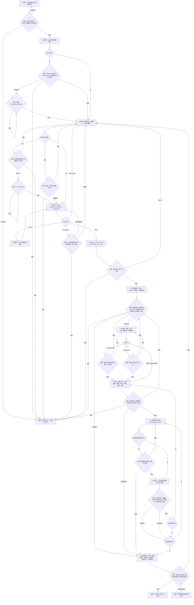

# Android TV Apps Helper

一个同时适配 Claude Desktop/Code、Codex、腾讯 WorkBuddy 与豆包工作的 Android TV 引导式 Skill。它把“连电视、选软件、核验 APK、安装、验证、恢复”收敛成可检查的状态机，让用户每轮只回答一个明确问题。

当前版本：`v0.3.0`

## 交互原则

- 每个交互回合只出现一个必答问题，并给出互斥选项。
- 宿主支持表单/选择卡时使用原生 UI；不支持或渲染失败时，原题原选项降级为编号文字菜单。
- 空白、含糊、同时选择多个单选项、回答旧问题或格式错误都不会推进状态；插件会停留在原题。
- 推荐项只标注，不预选。
- 所有 ADB 设备命令绑定已确认的 `serial`。
- 安装前展示不可变计划；设备、文件摘要、命令或风险发生变化时，原批准失效。
- “APK 有效”“已安装”“已启动”“有运行信号”“用户现场验收”分别记录，不混写为“正常”。

## 四平台兼容原则

四个平台共享同一份 S0–S11 状态机、`pending_question` 问题锁、ADB 安全约束、APK 来源规则和证据等级。平台适配器只能改变安装入口、Skill 根目录定位和选择控件的呈现方式，不能改变核心判断与用户批准边界。

| 平台 | 分发方式 | 本地执行要求 | v0.3.0 验证状态 |
|---|---|---|---|
| Codex | 仓库 Plugin / Marketplace | 本地 Shell | 等待本轮真人机验证 |
| 腾讯 WorkBuddy | Agent 对话安装或上传 ZIP | 本地电脑任务和 Bash | 等待本轮真人机验证 |
| 豆包工作 | Agent 对话安装或本地导入 ZIP | 必须使用本地电脑，不能使用云电脑 | 等待本轮真人机验证 |
| Claude Desktop/Code | Desktop 上传 ZIP；Code 使用 `.claude/skills` | 本地代码执行 | 自动化包验证通过；本轮按要求不做真人机验证 |

机器可读状态见 [`docs/platform-compatibility.json`](docs/platform-compatibility.json)，逐项证据见 [`docs/platform-validation.md`](docs/platform-validation.md)。

## 完整状态流转



所有未明确、无效或过期的回答，都回到当前 `Q*`，不执行后续命令。完整协议见 [Interaction Contract](plugins/android-tv-apps-helper/skills/android-tv-apps-helper/references/interaction-contract.md) 和 [Workflow States](plugins/android-tv-apps-helper/skills/android-tv-apps-helper/references/workflow.md)。

## 用户看到的交互

宿主支持必填选择组件时，Agent 提交一个问题卡；否则显示同构文字菜单：

```text
问题 S4-Q1：这是要操作的电视吗？

1. 确认这台电视（推荐）——后续命令只发送到此设备
2. 换一台——返回设备发现
0. 安全退出——停止尚未执行的工作

请明确回复：1、2 或 0。
```

如果用户回复“好的”“随便”“你决定”或同时回复 `1,2`，状态不会前进，Agent 会解释一次并重复 `S4-Q1`。

## 腾讯 WorkBuddy：从安装到使用

> 这里的 WorkBuddy 指腾讯中国大陆版桌面办公 Agent。首选安装方式是在 WorkBuddy Agent 对话中直接提供本项目 GitHub Release 的 WorkBuddy 专用 ZIP 地址；该方式已经完成实际安装验证。若当前客户端无法从对话安装，再使用“上传技能”作为兼容回退。WorkBuddy 不使用 Codex 的 `$skill`、`plugin marketplace` 或 `.codex-plugin` 安装方式。

### 第 1 步：安装腾讯 WorkBuddy

1. 从[腾讯 WorkBuddy 官方网站](https://cloud.tencent.com/product/workbuddy)下载并安装桌面客户端。
2. 登录后完成首次启动设置。
3. 建议保留默认权限或安全沙箱；运行到确实需要本地终端、工作目录或局域网访问时，再核对并授权对应权限。

WorkBuddy 官方说明 Skill 可以封装脚本并通过 Bash 执行；第三方 Skill 会以用户身份读取获准文件或执行命令，因此安装前应核对来源、脚本和权限。参见[腾讯 WorkBuddy 技能说明](https://www.workbuddy.cn/docs/workbuddy/From-Beginner-to-Expert-Guide/Function-Description/Skills-Market)和[开放平台 Skill 结构规范](https://open.workbuddy.cn/docs/skill)。

### 第 2 步：在 WorkBuddy Agent 对话中直接安装（推荐）

在 WorkBuddy 中新建 Agent 对话，完整粘贴并发送下面这段提示词：

```yaml
请安装 Android TV Apps Helper Skill。

Skill 安装包：
https://github.com/HXWfromDJTU/android-tv-apps-helper/releases/download/v0.3.0/android-tv-apps-helper-workbuddy-v0.3.0.zip
```

WorkBuddy Agent 可以根据该 GitHub Release 地址下载并完成 Skill 安装。这个对话安装渠道已在腾讯中国大陆版 WorkBuddy 中实际验证成功。

安装完成后，进入「专家·技能·连接器」→「技能」→「已安装」，确认：

- 名称为 `Android TV Apps Helper`；
- 版本为 `0.3.0`；
- Skill 已启用；
- WorkBuddy 的安全扫描没有显示异常。

如果 Agent 明确提示当前客户端不能下载或安装该 Skill，或者安装后没有出现在「已安装」列表中，请继续使用下一步的手动上传方式；不要仅根据 Agent 的文字回复判断安装已经成功。

### 第 3 步：手动下载并上传（兼容回退）

打开本项目 [v0.3.0 Release](https://github.com/HXWfromDJTU/android-tv-apps-helper/releases/tag/v0.3.0)，只下载以下两个文件：

- `android-tv-apps-helper-workbuddy-v0.3.0.zip`
- `SHA256SUMS`

不要上传 GitHub 自动生成的 `Source code (zip)`，也不要上传 Codex 插件目录；WorkBuddy 需要的是上述专用 ZIP。

macOS 可用以下命令下载并核验：

```sh
mkdir -p ~/Downloads/android-tv-apps-helper-v0.3.0
cd ~/Downloads/android-tv-apps-helper-v0.3.0
curl -fLO https://github.com/HXWfromDJTU/android-tv-apps-helper/releases/download/v0.3.0/android-tv-apps-helper-workbuddy-v0.3.0.zip
curl -fLO https://github.com/HXWfromDJTU/android-tv-apps-helper/releases/download/v0.3.0/SHA256SUMS
shasum -a 256 -c SHA256SUMS
```

输出包含 `OK` 才继续上传。Windows 可在 PowerShell 中运行：

```powershell
$url = "https://github.com/HXWfromDJTU/android-tv-apps-helper/releases/download/v0.3.0"
Invoke-WebRequest "$url/android-tv-apps-helper-workbuddy-v0.3.0.zip" -OutFile "$HOME\Downloads\android-tv-apps-helper-workbuddy-v0.3.0.zip"
Invoke-WebRequest "$url/SHA256SUMS" -OutFile "$HOME\Downloads\SHA256SUMS"
Get-FileHash "$HOME\Downloads\android-tv-apps-helper-workbuddy-v0.3.0.zip" -Algorithm SHA256
Get-Content "$HOME\Downloads\SHA256SUMS"
```

确认两个命令展示的 SHA-256 一致，然后上传 Skill：

1. 启动 WorkBuddy。
2. 点击左侧的「专家·技能·连接器」。
3. 进入顶部「技能」页签。
4. 点击「添加技能」。
5. 选择「上传技能」。
6. 选择刚才下载的 `android-tv-apps-helper-workbuddy-v0.3.0.zip`，不要先解压。
7. 等待 WorkBuddy 完成解析和安全扫描。
8. 核对名称是 `Android TV Apps Helper`、版本是 `0.3.0`、作者是 `SwainWong`，并留意它需要 Bash 来执行本机 ADB harness。
9. 完成安装后，进入「已安装」，确认该 Skill 的开关处于启用状态。

官方界面路径与本地 Skill 上传方式以[腾讯 WorkBuddy 当前技能文档](https://www.workbuddy.cn/docs/workbuddy/From-Beginner-to-Expert-Guide/Function-Description/Skills-Market)为准。

### 第 4 步：准备独立工作目录

为每次电视操作准备一个独立目录，用来保存会话、计划、日志和最终报告。例如：

```sh
mkdir -p ~/Documents/WorkBuddy/android-tv-helper-session
```

在 WorkBuddy 中新建任务或项目，并选择该目录作为工作目录。只授权这个目录；不要把整个用户主目录作为工作区。运行 Skill 时还需要允许本地终端和访问同一局域网内的电视。

### 第 5 步：准备电视

1. 确保电脑和电视连接到同一可信局域网。
2. 在电视设置中打开开发者选项。
3. 打开电视提供的“网络调试”“无线调试”或 ADB 调试开关；不同厂商名称可能不同。
4. 暂时保留电视设置页面，便于查看 IP 地址和接受 RSA 授权提示。
5. 不需要提前把电视 IP、APK 路径或设备型号写进提示词；Skill 会在需要时用受约束的问题询问。

### 第 6 步：在 WorkBuddy 中显式选择 Skill

1. 在刚才的工作目录中新建一个对话任务。
2. 从输入框的 Skill 选择入口选择 `Android TV Apps Helper`；如果当前版本没有选择胶囊，也可以在首句明确写“请使用已安装的 Android TV Apps Helper Skill”。
3. 粘贴下一节的启动提示词并发送。

### 第 7 步：使用完整启动提示词

<details>
<summary>点击展开可直接复制的 WorkBuddy 提示词</summary>

```text
请显式使用已经安装并启用的 Android TV Apps Helper Skill，帮助我配置一台与当前电脑处于同一可信局域网的 Android TV。

如果当前会话没有成功加载该 Skill，或者无法访问 Skill 内的 references、scripts/tv-helper 或本地 Bash，请不要自行模拟执行；请停止并明确告诉我缺少哪一项。

本次目标：
1. 先发现、连接并让我确认唯一的目标电视。
2. 完成 Android 版本、SDK、ABI、存储、当前桌面和已安装应用的只读盘点。
3. 再让我选择推荐配置、指定应用、本地 APK、桌面清理、应用故障诊断或直接生成报告。
4. 安装前核验 APK 来源、文件大小、SHA-256、设备兼容性和现有版本。
5. 展示绑定目标 serial 和文件摘要的不可变计划；只有我明确批准后才能逐项执行。
6. 安装后分别记录文件有效、已安装、已启动、运行信号和现场验收五个证据等级。
7. 最终给出变更、未完成项、有意保留项、恢复命令以及产物路径。

交互必须遵守：
- 每轮只提出一个必答问题，并提供明确、互斥的编号选项。
- 能用选项表达的内容不要让我自由输入；能自动检查的信息不要询问我。
- 推荐项可以标注，但不得预选或替我决定。
- 空白、模糊、多选、过期或格式错误的回答不得推进状态；解释一句后重复同一个问题 ID 和选项。
- 宿主有原生必填选择组件时优先使用；没有或渲染失败时，保持同一个问题和选项，改用编号文字菜单。
- 每题都提供“0. 安全退出”。回答旧问题不能授权当前动作。

安全要求：
- 第一轮不得直接执行 ADB，必须先取得我对只读检查的明确选择。
- 只有 adb devices -l 的状态严格等于 device 才能执行设备命令。
- 每条设备命令必须使用 adb -s <已确认的-serial>。
- 未经新的明确批准，不得 root、刷机、恢复出厂、清除数据、降级、卸载、禁用包或修改默认桌面。
- Clash Meta 只能从 MetaCubeX 官方 GitHub Release 下载，不得镜像。
- 其他 APK 必须服从 references/apps.json 的来源、许可和 SHA-256 规则；pending_rights 或 pending_file 不得产生下载 URL。
- 安装前和执行前分别计算 SHA-256；设备、文件、命令、风险或计划正文变化时，原批准失效。
- 替换 Launcher 时必须先验证新 Launcher 的画面、Home 键和遥控导航；不得卸载系统原 Launcher。
- 同一种安全操作最多自动重试一次；再次失败就保留错误并让我选择下一步。
- 只有我现场确认画面、声音和遥控操作正常，才能写“正常运行”。

请从 S0 开始。你的第一条回复只能简短说明只读与变更边界，然后显示：

问题 S0-Q1：是否开始只读检查？

1. 开始只读检查（推荐）
2. 查看流程范围与安全边界
0. 安全退出

最后明确告诉我：只能回复 1、2 或 0。
```

</details>

### 第 8 步：按选项完成每轮操作

正常使用顺序如下：

| 阶段 | WorkBuddy 展示 | 用户需要做什么 |
|---|---|---|
| S0 开始 | 只读检查范围 | 明确回复 `1`、`2` 或 `0` |
| S1 ADB | ADB 版本或缺失结果 | 在选项中选择安装官方 Platform-Tools、提交现有路径或退出 |
| S2 发现 | 找到的电视及连接状态 | 多台时选择一台；零台时按选项重扫或提交 `IP: x.x.x.x` |
| S3 授权 | `device`、`unauthorized` 或 `offline` | 在电视上核对 RSA 提示，再明确选择重试或返回 |
| S4 锁定目标 | serial、厂商、型号、Android、SDK、ABI | 确认目标后，后续命令才绑定这台电视 |
| S5 盘点 | 存储、桌面、已装应用和目录版本 | 选择推荐配置、应用、本地 APK、桌面、诊断或报告 |
| S6–S8 计划 | 来源、摘要、兼容性、命令、影响、风险、恢复 | 批准全部、批准部分、修改或取消 |
| S9 执行 | 每个项目的命令结果 | 新增高风险动作时重新明确确认 |
| S10 验证 | 安装、启动与运行信号 | 在电视前选择画面、声音和遥控器的真实情况 |
| S11 报告 | 变更、证据、失败、保留项和恢复命令 | 选择完成、继续或保持现状退出 |

不要回复“好的”“继续”“随便”或“你决定”。只回复当前问题接受的编号或格式，例如：

```text
1
```

```text
IP: 192.168.1.20
```

```text
路径: /Users/your-name/Downloads/app.apk
```

### 第 9 步：检查最终产物

任务结束前确认 WorkBuddy 展示并保存：

- `session.json`：状态、待答问题和历史选择。
- 安装计划：plan ID、电视 serial、APK 路径和 SHA-256。
- 执行记录：命令、时间、stdout、stderr 和退出码。
- 最终报告：证据等级、失败项目、保留项目和恢复命令。

如果报告只证明“已安装”或“已启动”，但你还没有在电视前检查画面、声音和遥控器，应保留为“待现场验收”，不能改写为“正常”。

### 第 10 步：更新、关闭或卸载

- 更新：优先在 WorkBuddy Agent 新对话中发送“请安装 Android TV Apps Helper Skill”，并提供新版本 WorkBuddy ZIP 的 GitHub Release 直链；安装后在「已安装」中核对版本。若对话安装不可用，再下载新版 ZIP 和 `SHA256SUMS`，核验后通过「添加技能」→「上传技能」重新导入。
- 暂停：进入「已安装」，关闭 `Android TV Apps Helper`。关闭不会删除 Skill 文件，但它不会参与模型调用。
- 卸载：在「已安装」中打开该 Skill 的管理页面并选择卸载。
- 更换版本后应新建对话，避免旧会话继续使用已经加载的旧指令。

### WorkBuddy 常见问题

| 问题 | 处理方式 |
|---|---|
| Agent 无法从 GitHub 直接安装 | 确认使用的是 Release 中名称包含 `workbuddy` 的 ZIP 直链；仍无法安装时，按第 3 步下载、校验并手动上传 |
| Agent 回复已安装，但列表中不存在 | 以「专家·技能·连接器」→「技能」→「已安装」中的实际记录为准；不存在就按第 3 步手动上传 |
| ZIP 解析失败 | 确认上传的是 Release 中名称包含 `workbuddy` 的原始 ZIP，而不是 Source code ZIP；不要二次压缩 |
| Skill 没有触发 | 确认它在「已安装」中已启用，然后新建任务并从输入框显式选择该 Skill |
| 提示无法运行 Bash | 检查当前任务的本地终端权限与安全沙箱审批；不要直接切换为无条件完全访问 |
| 找不到 ADB | 在 S1 选择安装 Google 官方 Platform-Tools，或按要求提交现有 ADB 的绝对路径 |
| 电视显示 unauthorized | 查看电视屏幕并接受 RSA 授权；没有提示时按当前问题选择返回发现，而不是强行安装 |
| 电视显示 offline | 让 Skill 使用受约束的重连流程；存在其他设备时不要杀掉共享 ADB server |
| 没有选择卡片 | 这是允许的降级路径；Skill 应用同一问题 ID 和选项显示编号文字菜单 |
| 某 APK 显示 pending | 该文件缺失或公开再分发权未确认；选择跳过、提交有权使用的本地 APK 或返回 |

## 豆包工作：安装与使用

豆包工作必须运行“本地电脑”任务。云电脑位于远端环境，不能把它当成可访问家庭局域网电视的 ADB 主机；Skill 会在执行任何 ADB 命令前阻止这种组合。

1. 从[豆包工作官网](https://www.doubao.com/work)下载安装桌面客户端并登录。
2. 新建“本地电脑”任务，不要选择云电脑。
3. 把下面的安装指令完整发送给 Agent：

```yaml
请安装 Android TV Apps Helper Skill。

Skill 安装包：
https://github.com/HXWfromDJTU/android-tv-apps-helper/releases/download/v0.3.0/android-tv-apps-helper-doubao-work-v0.3.0.zip
```

4. 按客户端提示检查并确认 Skill 安装。完成后进入「技能·连接器·伙伴」或当前版本的技能管理入口，确认 `Android TV Apps Helper` 已出现并启用。
5. 如果 Agent 只能下载、不能导入，则手动下载同一个 ZIP，在技能管理中选择“导入本地技能文件”；不要上传 GitHub 自动生成的 Source code ZIP。
6. 新建本地电脑对话，通过 `/`、输入框“更多技能”或明确写出 Skill 名称进行调用：

```text
请明确使用已经安装的 Android TV Apps Helper Skill。
这是本地电脑任务。先不要执行 ADB；请完成宿主前置检查，然后从 S0 开始，并严格保持每轮一个必答问题。
```

首轮合格结果必须只说明只读与变更边界，并显示 `S0-Q1` 的 `1. 开始只读检查`、`2. 查看检查范围`、`0. 安全退出`。如果用户回复“继续”，应原样重显同一问题，且不得执行 ADB。

## Claude Desktop / Code：安装与使用

> `v0.3.0` 已完成自动化包结构与 harness 验证；本轮按用户要求暂不做 Claude 客户端真人机验证。

### Claude Desktop / claude.ai

1. 下载 `android-tv-apps-helper-claude-v0.3.0.zip`。
2. 打开 `Customize` → `Skills` → `+` → `Create skill` → `Upload a skill`。
3. 上传完整 ZIP，并开启该 Skill。自定义 Skill 需要账户支持自定义 Skills 与代码执行；以 [Claude 官方 Skills 说明](https://support.claude.com/en/articles/12512180-use-skills-in-claude)为准。
4. 新建对话，输入“请使用 Android TV Apps Helper，从 S0 开始”。

### Claude Code

将 ZIP 中的完整目录放入项目级 `.claude/skills/android-tv-apps-helper/`，或个人级 `~/.claude/skills/android-tv-apps-helper/`。Claude Code 会通过 `${CLAUDE_SKILL_DIR}` 定位随包 harness；目录位置和调用规则见 [Claude Code 官方文档](https://code.claude.com/docs/en/skills)。

```text
/android-tv-apps-helper 请帮我配置这台 Android TV，从 S0 开始
```

## Codex 插件安装

### Codex App

```sh
git clone https://github.com/HXWfromDJTU/android-tv-apps-helper.git
cd android-tv-apps-helper
```

将仓库作为受信任项目打开并重启客户端。项目的 `.agents/plugins/marketplace.json` 会提供 `Android TV Tools` marketplace，安装其中的 `Android TV Apps Helper`。仓库内 `.codex/config.toml` 已为该项目启用插件。

### 支持 plugin marketplace 命令的 Codex CLI

```sh
codex plugin marketplace add HXWfromDJTU/android-tv-apps-helper --ref main
```

不同 Codex CLI 版本的插件命令可用性不同；若 `codex plugin --help` 不存在，请使用桌面端安装路径。

Codex 安装后可输入：

```text
使用 $android-tv-apps-helper 帮我配置这台 Android TV
```

## APK 下载策略

| 应用 | 状态 | 下载位置 |
|---|---|---|
| Clash Meta for Android 2.11.33 | 官方源 | 仅 [MetaCubeX 官方 Release](https://github.com/MetaCubeX/ClashMetaForAndroid/releases/tag/v2.11.33)，不镜像 |
| SmartTube 32.10 Stable | 可镜像 | 本项目 `v0.1.0` Release；字节与上游 Release 摘要一致 |
| 当贝市场、Emotn UI、奈飞工厂TV | 等待权利证明 | 不公开 APK 或下载 URL |
| 佳视通、乘风TV、魄狼TV | 等待文件和权利证明 | 不公开 APK 或下载 URL |

机器可读目录位于 [`catalog/apps.json`](plugins/android-tv-apps-helper/catalog/apps.json)，第三方声明见 [THIRD_PARTY_NOTICES.md](THIRD_PARTY_NOTICES.md)。APK 二进制只放 GitHub Releases，不写入 Git 历史。

## Harness 命令

```sh
HELPER=plugins/android-tv-apps-helper/scripts/tv-helper

# 创建会话并锁定平台、执行环境和交互界面类型
$HELPER init-session outputs/demo/session.json --surface text_menu \
  --host-platform codex --execution-context local_computer

# 校验目录；--eligible 只显示当前可下载项
$HELPER catalog --catalog plugins/android-tv-apps-helper/catalog/apps.json --eligible

# 枚举设备并读取目标身份
$HELPER adb-list
$HELPER adb-inspect --serial 192.168.1.20:5555 --state device

# 校验 APK，生成不可变计划，精确批准后才允许安装
$HELPER apk-inspect /absolute/app.apk --sha256 EXPECTED_SHA256
$HELPER plan-install outputs/demo/session.json --app-id app-id \
  --serial 192.168.1.20:5555 --apk /absolute/app.apk \
  --sha256 EXPECTED_SHA256 --out outputs/demo/plan.json
$HELPER approve-install outputs/demo/session.json \
  --plan outputs/demo/plan.json --confirmation confirm_install
$HELPER install-approved outputs/demo/session.json \
  --plan outputs/demo/plan.json --state device
```

`approve-install` 不接受泛化的 `yes` 或“继续”。安装前会再次计算 SHA-256，并核对批准的计划 ID、目标 serial 和设备状态。

## 开发与验证

仅依赖 Python 3.10+ 标准库：

```sh
python3 -m unittest discover -s tests -v
python3 -m compileall -q plugins/android-tv-apps-helper/scripts
python3 scripts/build_platform_packages.py --platform workbuddy \
  --output dist/android-tv-apps-helper-workbuddy-v0.3.0.zip
python3 scripts/build_platform_packages.py --platform doubao-work \
  --output dist/android-tv-apps-helper-doubao-work-v0.3.0.zip
python3 scripts/build_platform_packages.py --platform claude \
  --output dist/android-tv-apps-helper-claude-v0.3.0.zip
shasum -a 256 dist/android-tv-apps-helper-*-v0.3.0.zip > dist/SHA256SUMS
```

打包器会从同一份 Codex 核心 Skill、references、harness 和 catalog 生成各平台自包含 ZIP；平台包只调整 frontmatter 和 harness 定位方式，不复制核心流程。所有 ZIP 都不会包含 APK、Codex manifest 或 `agents/openai.yaml`。输出采用固定文件顺序、时间戳和权限，便于重现并核对 SHA-256。

项目许可证为 [MIT](LICENSE)。第三方 APK 适用其各自许可证。
