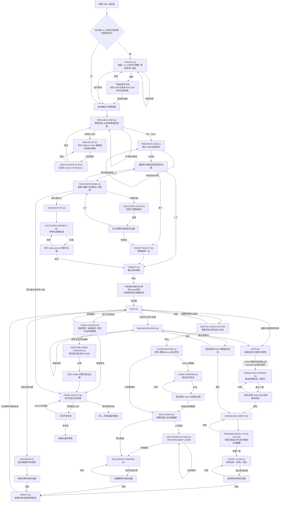

# Android TV Apps Helper

一个面向非技术用户的 Android TV 对话式 Skill。它用固定状态机引导用户完成只读预检查、电视确认、应用选择、APK 下载与校验、安装、桌面/壁纸设置、现场验收和 ADB 安全收尾。

当前测试版：**`v0.4.0-rc.1`：统一 HTML 点选**。稳定版仍为 `v0.3.4`，稳定更新检查不会自动推送测试版。四个平台包共享同一套 Python harness；UI 不改变问题、批准边界或结果判断。

## 新版交互与验收范围

| 状态 | 改动 | 用户看到的效果 |
|---|---|---|
| ✅ | 四个桌面平台统一 HTML | Codex、Claude Desktop、WorkBuddy、豆包工作使用同一页面；优先 MCP App 内嵌，不可用时打开本地点选网页 |
| ✅ | 完整应用列表 | 同屏列表滚动、多选；不再把应用拆成多页原生选择题 |
| ✅ | 固定底部确认 | 勾选应用后直接点「确认所选应用，进入安装流程」，不必翻页找按钮 |
| ✅ | 按名称再次确认 | 先确认下载哪些应用，下载与安装仍分别批准，不把勾选当成安装授权 |
| ✅ | 上下文可读 | 表格、状态 emoji、阻塞点和操作指引在问题上方；标题只放简短问题 |
| ✅ | 等待真实点击 | 空选、重复、过期回调不能推进；补充输入在选项之后；不退回文字编号菜单 |
| ⚠️ | 客户端实际内嵌 | 已有协议/浏览器测试和客户端能力线索，但本版尚未完成真实客户端安装与内嵌点击验收 |
| ⏭️ | Claude Code | 继续使用原生选择组件；不属于桌面 HTML 迁移范围 |

**Skill ZIP 不会自动注册 MCP 组件。** 普通 HTML 预览也不等于能把点击回传给 Agent。内嵌需要配置本地 MCP server；没有 MCP 时可以直接使用本地浏览器模式，仍然是点击选择。详见 [HTML 接入说明](plugins/android-tv-apps-helper/skills/android-tv-apps-helper/references/html-interaction.md) 和 [本版测试报告](docs/platform-validation-v0.4.0-rc.1.md)。

## v0.4.0-rc.1 从安装到使用

### 1. 安装当前平台的 Skill

在对应 Agent 新建本地电脑会话，复制以下提示词，将链接换成下表中对应平台的链接即可。不要让云电脑连接家中电视。

```text
请安装 Android TV Apps Helper v0.4.0-rc.1 测试版。
下载并校验同一 Release 的 SHA256SUMS；备份当前 Skill 后再替换，保留会话和用户数据，不动其他 Skill。
安装包：https://github.com/SwainWong/android-tv-apps-helper/releases/download/v0.4.0-rc.1/android-tv-apps-helper-workbuddy-v0.4.0-rc.1.zip
安装后报告实际安装路径与版本。现在不要连接或修改电视。
这是 HTML 交互版本：请读取 references/html-interaction.md。
若已注册本插件 MCP server，请核实 tv_ui_show 可调用；否则先使用无需额外依赖的本地浏览器模式，不要声称 ZIP 安装已经配置好了内嵌组件。
```

| 平台 | 安装 ZIP |
|---|---|
| 腾讯 WorkBuddy 中国大陆版 | [WorkBuddy ZIP](https://github.com/SwainWong/android-tv-apps-helper/releases/download/v0.4.0-rc.1/android-tv-apps-helper-workbuddy-v0.4.0-rc.1.zip) |
| 豆包工作 | [豆包工作 ZIP](https://github.com/SwainWong/android-tv-apps-helper/releases/download/v0.4.0-rc.1/android-tv-apps-helper-doubao-work-v0.4.0-rc.1.zip) |
| Codex | [Codex ZIP](https://github.com/SwainWong/android-tv-apps-helper/releases/download/v0.4.0-rc.1/android-tv-apps-helper-codex-v0.4.0-rc.1.zip) |
| Claude Desktop / Code | [Claude ZIP](https://github.com/SwainWong/android-tv-apps-helper/releases/download/v0.4.0-rc.1/android-tv-apps-helper-claude-v0.4.0-rc.1.zip) |

如果宿主只下载而没有安装，使用它的技能管理导入同一个 ZIP。Codex 可装到个人 Skills；Claude Code 可装到 `.claude/skills/`。Claude Desktop 还需要可在本机执行 harness 的能力；仅云端代码执行或仅 UI MCP server 都不能操作本机电视。安装成功要以实际目录/技能列表和新会话调用为准，不能只看下载提示。

### 2. 可选：启用聊天内嵌 HTML

可以把下面提示词交给安装 Agent；也可跳过，先用本地浏览器点选：

```text
请为 Android TV Apps Helper 配置本地 MCP Apps 内嵌交互。
按 references/html-interaction.md，在 Skill 内建立独立 Python 3.11+ 虚拟环境，安装 scripts/mcp-requirements.txt。
保留现有 MCP 配置，新增 stdio 服务：虚拟环境 Python 运行 scripts/tv-helper mcp-ui --session-root <只包含本插件会话的现有目录>，所有路径使用绝对路径。
不要开启全局免确认或绕过权限。告诉我是否需要重启/新建会话，并实际检查 tv_ui_show、页面渲染和点击回传。
若当前客户端不能内嵌，请使用 serve-ui / wait-ui 本地浏览器点选，不使用文字编号菜单，也不要代我点击。
```

不同客户端的 MCP 设置入口和权限流程由客户端决定，不直接覆盖整个配置文件。本版没有替用户预注册云服务或 Buddy App。MCP 注册失败不影响纯标准库浏览器模式；两条通道都不可用时保留当前问题并解释阻塞。

### 3. 启动

新建会话，发送：

```text
使用 Android TV Apps Helper v0.4.0-rc.1，采用当前桌面平台的 HTML 点选流程。
先自动只读预检查；在上下文中表格展示结果、阻塞和解决方法，标题保持简短。
打开真实可点击页面，等待我的选择。应用完整多选，底部固定显示「确认所选应用，进入安装流程」。
页面提交后读取同一 session 的真实状态；需要执行时仅执行已批准动作并回传证据。
保持 MCP tv_ui_wait 或浏览器 wait-ui 等待循环，不要让我输入数字或输入“继续”来触发下一题。
```

### 4. 按页面完成流程

1. 查看预检查结果，确认同一 Wi-Fi 和电视调试权限；缺少 ADB 时按页面指引处理。
2. 确认正确电视，勾选需要的应用。选中后底部显示已选名称，随时可确认，不用翻页。
3. 核对应用名称和版本后批准下载；检查结果再生成安装方案，由你单独批准安装。
4. 如选择桌面/壁纸，先看当前系统兼容风险，再分别批准；壁纸可能被电视系统恢复。
5. 检查画面、声音与遥控器结果，最后按电视型号指引关闭 ADB/无线调试和开发者模式。

输入 IP、路径等信息前先点「填写信息」入口；补充说明不能代替选择或批准。已有旧会话不要重新初始化覆盖：让 Agent 使用 `resume-html` 恢复当前问题，保留已选应用。Codex HTML 不依赖 Plan 模式的问答工具。

### 5. 测试版限制

浏览器页面不会自行唤醒已经结束回合的 Agent，因此 Agent 必须保持有上限的等待循环；若宿主不允许后台进程或等待，会明确暂停。本版浏览器/协议通过不等于四客户端内嵌通过，真实电视未操作。请反馈具体平台、版本和卡住的页面，不要公开包含凭据的本地页面 URL 或 session 文件。

<details>
<summary>历史稳定版 v0.3.4 的原生交互安装说明（不适用于上面的 HTML 测试版）</summary>

## 这个版本解决了什么

| 状态 | 能力 | 行为 |
|---|---|---|
| ✅ | Codex 按能力选择组件 | 实际暴露异步工具时优先使用；否则使用当前模式允许的同步工具，不再一律要求 Plan |
| ✅ | RA 应用图标 | Skill ZIP 含图标和界面元数据，repository plugin 同时配置图标与 Logo |
| ✅ | 完整应用选择 | 全部应用可选，不因来源未预审而隐藏或禁用；有地址就下载，缺地址由 Agent 在确认后查找 |
| ✅ | 简短问题与外置上下文 | 先在对话中展示上一轮结果表格、阻塞点和指引；组件只保留问题与选项，不往标题堆文字 |
| ✅ | 不允许模糊回答 | “继续”“好的”“你决定”不会推进；仍显示原问题和原选项 |
| ✅ | 自动预检查 | 首题前执行 `adb version` 与 `adb devices -l` 等被动只读检查，不扫描局域网、不连接未知地址 |
| ✅ | 操作证据门禁 | 下载、安装、连接、诊断、Home、壁纸和退出复核都必须提交真实证据后才进入结果状态 |
| ✅ | 应用多选与二次确认 | 原生多选或分页面点击添加/取消，完成选择后按应用名称和版本再次确认 |
| ✅ | 壁纸与 Home 风险 | 显示已检查到的电视型号；未匹配成功证据时高亮提示大概率失败或被系统恢复 |
| ✅ | 表格化结果 | 每轮和最终结果使用 Markdown 表格；✅ 已完成，❌ 尝试后仍失败 |
| ✅ | 安全收尾 | 最后提醒关闭 ADB/无线调试和开发者模式，并显示匹配型号或通用关闭步骤 |
| ✅ | 强制原生选择 | 每个决策调用原生工具；选项过多时分页，填写信息先选择入口；不再降级为编号文字菜单 |

## 安装包

应用下载不需要等待项目维护者审核来源。所有应用保留在原生选择列表中；目录尚无链接不等于不可选，而是确认后由 Agent 查找。找不到链接或实际下载失败会如实显示失败并提供原生重试选项，不伪造成功。文件完整性/包名校验与安装二次确认仍保留。Emotn UI 链接来自其[官网页面](https://app.emotn.com/ui/)。

验收边界：本版修复多轮强选择、原生分页、填写入口和被动发现结果回写；自动化与真实客户端 UI 验收分别记录。宿主工具未提供或重试仍失败时暂停并保留问题，不再要求用户输入编号。Skill 无法凭空生成宿主缺失的组件。详见[测试报告](docs/platform-validation.md)。

| 平台 | 安装包 |
|---|---|
| WorkBuddy | `android-tv-apps-helper-workbuddy-v0.3.4.zip` |
| 豆包工作 | `android-tv-apps-helper-doubao-work-v0.3.4.zip` |
| Claude Desktop / Code | `android-tv-apps-helper-claude-v0.3.4.zip` |
| Codex | `android-tv-apps-helper-codex-v0.3.4.zip`，或本仓库 repository plugin |

所有 ZIP 和 `SHA256SUMS` 位于 [v0.3.4 Release](https://github.com/HXWfromDJTU/android-tv-apps-helper/releases/tag/v0.3.4)。安装前可用：

```sh
(cd 下载目录 && shasum -a 256 -c SHA256SUMS)
```

### 使用前准备

| 状态 | 需要准备 | 说明 |
|---|---|---|
| ✅ | 本地电脑 Agent | 电脑必须能访问电视所在局域网；云电脑不适用 |
| ⏳ | 电脑与电视连接同一可信 Wi-Fi | Skill 首轮会读取本机 IPv4，并列出 `adb devices -l` 的被动结果 |
| ⏳ | Android 官方 Platform-Tools | 若未找到 ADB，问题卡会给出[官方下载页](https://developer.android.com/tools/releases/platform-tools)和路径验证步骤 |
| ⏳ | 在电视上开启 ADB/网络调试 | 通用步骤：设置 → 系统/设备偏好设置 → 关于 → 连续选择版本约 7 次 → 开发者选项 → 开启 ADB/网络调试 |

任务结束时，Skill 会根据已识别型号提醒关闭 ADB/无线调试和开发者模式，并做一次只读冲突复核。

## WorkBuddy 安装与使用

### 1. 用 Agent 对话从 GitHub 安装

新建 WorkBuddy Agent 对话，完整发送：

```text
请安装 Android TV Apps Helper Skill。

Skill 安装包：
https://github.com/HXWfromDJTU/android-tv-apps-helper/releases/download/v0.3.4/android-tv-apps-helper-workbuddy-v0.3.4.zip

安装完成后，请告诉我技能名称和版本；先不要连接或修改电视。
```

正常更新直接发送安装提示词，Skill 会先校验新包再切换。只有需要“干净重装”时，才先下载新 ZIP 和 `SHA256SUMS` 完成校验，然后发送：

```text
请只删除当前已安装的 Android TV Apps Helper Skill，不要删除其他 Skill。删除后告诉我结果。
```

删除确认后，立即发送上面的安装提示词。只有在技能列表能看到 `Android TV Apps Helper` 且版本为 `0.3.4`，才算安装完成。若当前 Agent 只下载 ZIP 而没有安装，进入“专家·技能·连接器 → 技能 → 添加技能 → 上传技能”，上传同一个已校验 WorkBuddy ZIP。

### 2. 开始使用

```text
请使用 Android TV Apps Helper 帮我检查并设置这台 Android 电视。先自动做只读预检查；每轮先在对话中用表格和 ✅／❌／⚠️ 显示上一轮结果，再展示阻塞点和解决方法；原生选择组件只放简短问题与选项，不把上下文塞进标题。我没有明确选择时不要进入下一步。
```

## 豆包工作安装与使用

### 1. 优先尝试对话安装

```text
请安装 Android TV Apps Helper Skill。

Skill 安装包：
https://github.com/HXWfromDJTU/android-tv-apps-helper/releases/download/v0.3.4/android-tv-apps-helper-doubao-work-v0.3.4.zip

安装完成后，请告诉我技能名称和版本；先不要连接或修改电视。
```

如果对话只完成下载，打开豆包工作的技能管理，选择本地导入并上传该 ZIP。必须新建“本地电脑”任务；云电脑无法安全访问用户家中局域网里的电视。

### 2. 开始使用

```text
请在本地电脑中使用 Android TV Apps Helper 帮我检查并设置 Android 电视。请先执行自动只读预检查，然后只显示 Skill 当前生成的一个必答问题；我没有明确选择时，保持当前问题不变。
```

## Codex 安装与使用

### v0.3.3 安装成功却没有选项框？

v0.3.3 只适配了同步 `request_user_input`。若当前模式不允许该工具，即使另有 `request_user_input_async`，旧版也会停止并建议 Plan。v0.3.4 会先检查实际可调用工具：异步优先，同步按模式限制使用；两者均不可用才保留问题并暂停。不能仅凭“Default”判断组件一定不可用。

异步调用成功仅表示问题已发送，不表示用户已确认；仍须等待明确选择。每轮结果表格留在对话中，卡片只显示简短问题和选项。

安装提示词：

```text
请从 GitHub 安装 Android TV Apps Helper v0.3.4 Codex Skill，并校验同一 Release 的 SHA256SUMS：
https://github.com/SwainWong/android-tv-apps-helper/releases/download/v0.3.4/android-tv-apps-helper-codex-v0.3.4.zip
安装后检查 agents/openai.yaml 以及 assets/ra-icon.png 均存在。
新会话启动时检查当前可用的原生提问工具；若有 request_user_input_async 就使用它，不要直接要求切换 Plan，也不要用文字编号替代组件。
```

旧会话暂停在某题时，Agent 可在确认异步工具实际可用后运行 `resume-native <session> --question-id <当前题号> --native-tool request_user_input_async`。不要删除会话或手改 JSON 来跳过问题。

RA 图标通过 Skill 的 `agents/openai.yaml` 和插件的 `composerIcon` / `logo` 配置，资源随包发布。重装后新建会话；旧会话可能缓存旧元数据。其他平台是否显示自定义图标由宿主导入器决定，不能用“文件已打包”代替“界面已显示”的验收。

### 1. 从 GitHub 获取 repository plugin

可让 Codex 从 Release 的 `android-tv-apps-helper-codex-v0.3.4.zip` 安装个人 Skill；开发者也可使用完整 repository plugin：

```sh
git clone https://github.com/HXWfromDJTU/android-tv-apps-helper.git
cd android-tv-apps-helper
```

用 Codex 打开该仓库。仓库内的 `.agents/plugins/marketplace.json`、`.codex/config.toml` 和 `plugins/android-tv-apps-helper/` 共同提供 repository plugin。若此前装过缓存版本，先在 Codex 的插件管理中只卸载 `android-tv-apps-helper`，再从当前仓库重新安装或启用；不要直接复制或修改 Codex 缓存目录。

### 2. 开始使用

```text
请使用当前仓库的 Android TV Apps Helper Skill 帮我检查并设置 Android 电视。严格执行 harness 状态机：先自动只读预检查；每轮只展示一个必答问题，并把上一轮结果、当前阻塞和解决指引放进同一个问题区域；没有明确答案不得推进；任何操作必须在批准后执行并回传真实证据。
```

## Claude Desktop / Claude Code

- Claude Code：解压 Claude ZIP，把 `android-tv-apps-helper/` 放到项目 `.claude/skills/` 或个人 `~/.claude/skills/`。
- Claude Desktop：在支持自定义 Skills 和本地代码执行的版本中导入 Claude ZIP。
- 如果运行环境不能访问本机局域网，Skill 会在 ADB 前停止，不会假装完成。

本版本按用户要求只做包合同和自动化验证，未做 Claude 实机客户端验收。

## 对话规则

1. 每轮先展示 3–6 行重要结果表，再给阻塞/风险、解决步骤、一个问题和互斥选项。
2. 每个决策必须调用原生选择组件。超出上限使用“更多选项”分页；不会因 5 个选项而改用文字菜单。
3. 先给选择项，组件末尾保留宿主自带补充输入。IP／路径先点“填写信息”，再使用补充输入框；补充说明和默认选中都不等于批准。多选超限时使用点击添加/取消与完成选择。
4. 模糊、重复、越界、已禁用或旧问题的回答不会推进状态。
5. 表格和处理指引固定放在组件前的可见对话中，组件只保留简短问题和选项。调用失败原生重试一次；工具缺失或再次失败则暂停，禁止静默文字降级。
6. 原问题有“安全退出”时，每页都保留它；翻页不批准操作，使用过 ADB 后仍进入安全收尾。客户端恢复后可继续当前问题。

</details>

## 完整状态流转



## APK 来源与当前可用性

| 应用 | 来源策略 | 当前状态 |
|---|---|---|
| Clash Meta for Android | MetaCubeX 官方 GitHub Release | ✅ 可下载并校验 |
| SmartTube | 上游 MIT 项目，经本项目 Release 分发且固定 SHA-256 | ✅ 可下载并校验 |
| 当贝市场 6.0.7 | 已记录的发布页 CDN 链接 | ✅ 可选并发起下载，不等维护者预审；HTTP 567 是历史观察，不代表每次运行都失败 |
| Emotn UI | 已记录官网页面的 APK 链接 | ✅ 可选并发起下载；本轮未下载验证包体 |
| 佳视通、乘风TV、魄狼TV、奈飞工厂TV | 目前目录未记录下载链接 | ✅ 可选；确认后 Agent 查找链接，实际找不到才报告失败，不隐藏 |

当贝使用目录内已有 CDN 地址；实际不可达时在当前点选界面提供重试、返回列表或退出，不再让用户上传本地 APK。下载到用户电脑与公开镜像到本项目是两个动作；本次开放下载选择，不等于已将全部 APK 上传至 GitHub。

## 安全边界

- 所有电视命令必须使用 `adb -s <已确认设备>`。
- 不 root、不刷机、不恢复出厂设置、不清空数据。
- 不卸载或禁用原厂桌面；Home 和壁纸是两次独立批准。
- “命令成功”不等于“电视现场正常”；画面、声音和遥控必须由用户确认。
- ADB 断开不等于开发者模式已经关闭；用户确认与只读冲突复核分开记录。

## 开发与验证

```sh
PYTHONPATH=plugins/android-tv-apps-helper/scripts python3 -m unittest discover -s tests -v
python3 scripts/build_release.py --output-dir dist
(cd dist && shasum -a 256 -c SHA256SUMS)
```

本版验证结果见 [HTML 测试报告](docs/platform-validation-v0.4.0-rc.1.md)，历史验证见 [平台报告索引](docs/platform-validation.md)，历史问题和解决方案见 [docs/ux-feedback-log.md](docs/ux-feedback-log.md)。

## License

Skill 和 harness 使用 [MIT License](LICENSE)。第三方应用仍受各自发布者许可约束，详见 [THIRD_PARTY_NOTICES.md](THIRD_PARTY_NOTICES.md)。
