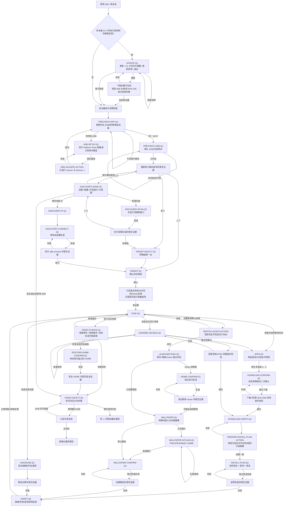

# Android TV Apps Helper

一个面向非技术用户的 Android TV 对话式 Skill。它用固定状态机引导用户完成只读预检查、电视确认、应用选择、APK 下载与校验、安装、桌面/壁纸设置、现场验收和 ADB 安全收尾。

当前版本：`v0.3.1`。支持 Codex、腾讯 WorkBuddy 中国大陆版、豆包工作，以及 Claude Desktop / Claude Code 包。四个平台包共享同一套 Python harness 和流程合同；平台 UI 只改变展示形式，不改变问题、选项、批准边界或结果判断。

## 这个版本解决了什么

| 状态 | 能力 | 行为 |
|---|---|---|
| ✅ | 问题内上下文 | 每个问题组件先显示上一轮结果、阻塞点、解决方法，再显示一个必答问题 |
| ✅ | 不允许模糊回答 | “继续”“好的”“你决定”不会推进；仍显示原问题和原选项 |
| ✅ | 自动预检查 | 首题前执行 `adb version` 与 `adb devices -l` 等被动只读检查，不扫描局域网、不连接未知地址 |
| ✅ | 操作证据门禁 | 下载、安装、连接、诊断、Home、壁纸和退出复核都必须提交真实证据后才进入结果状态 |
| ✅ | 应用多选与二次确认 | 支持原生多选；文字模式可回复 `1、2`，随后用应用名称和版本再次确认 |
| ✅ | 壁纸与 Home 风险 | 显示已检查到的电视型号；未匹配成功证据时高亮提示大概率失败或被系统恢复 |
| ✅ | 表格化结果 | 每轮和最终结果使用 Markdown 表格；✅ 已完成，❌ 尝试后仍失败 |
| ✅ | 安全收尾 | 最后提醒关闭 ADB/无线调试和开发者模式，并显示匹配型号或通用关闭步骤 |
| ✅ | 原生选择组件优先 | 兼容题目必须调用宿主原生选择工具；只有记录真实失败或题型不兼容后才能显示文字菜单 |

## 安装包

验收边界：116 项自动化测试通过；WorkBuddy、豆包的早期候选包已实测原生选择组，但最终包界面复测受电脑控制服务故障阻塞。Codex 最终包已实测只读预检；其四选项问题超过原生工具上限，会明确说明原因后显示完整文字选项。超出宿主选项上限或不支持的题型暂不分页，不保证每题均为原生组件。详见[测试报告](docs/platform-validation.md)。

| 平台 | 安装包 |
|---|---|
| WorkBuddy | `android-tv-apps-helper-workbuddy-v0.3.1.zip` |
| 豆包工作 | `android-tv-apps-helper-doubao-work-v0.3.1.zip` |
| Claude Desktop / Code | `android-tv-apps-helper-claude-v0.3.1.zip` |
| Codex | `android-tv-apps-helper-codex-v0.3.1.zip`，或本仓库 repository plugin |

所有 ZIP 和 `SHA256SUMS` 位于 [v0.3.1 Release](https://github.com/HXWfromDJTU/android-tv-apps-helper/releases/tag/v0.3.1)。安装前可用：

```sh
(cd 下载目录 && shasum -a 256 -c SHA256SUMS)
```

### 使用前准备

| 状态 | 需要准备 | 说明 |
|---|---|---|
| ✅ | 本地电脑 Agent | 电脑必须能访问电视所在局域网；云电脑不适用 |
| ⏳ | 电脑与电视连接同一可信 Wi-Fi | Skill 首轮会读取本机 IPv4，并列出 `adb devices -l` 的被动结果 |
| ⏳ | Android 官方 Platform-Tools | 若未找到 ADB，问题卡会给出[官方下载页](https://developer.android.com/tools/releases/platform-tools)和路径验证步骤 |
| ⏳ | 在电视上开启 ADB/网络调试 | 通用步骤：设置 → 系统/设备偏好设置 → 关于 → 连续选择版本约 7 次 → 开发者选项 → 开启 ADB/网络调试 |

任务结束时，Skill 会根据已识别型号提醒关闭 ADB/无线调试和开发者模式，并做一次只读冲突复核。

## WorkBuddy 安装与使用

### 1. 用 Agent 对话从 GitHub 安装

新建 WorkBuddy Agent 对话，完整发送：

```text
请安装 Android TV Apps Helper Skill。

Skill 安装包：
https://github.com/HXWfromDJTU/android-tv-apps-helper/releases/download/v0.3.1/android-tv-apps-helper-workbuddy-v0.3.1.zip

安装完成后，请告诉我技能名称和版本；先不要连接或修改电视。
```

正常更新直接发送安装提示词，Skill 会先校验新包再切换。只有需要“干净重装”时，才先下载新 ZIP 和 `SHA256SUMS` 完成校验，然后发送：

```text
请只删除当前已安装的 Android TV Apps Helper Skill，不要删除其他 Skill。删除后告诉我结果。
```

删除确认后，立即发送上面的安装提示词。只有在技能列表能看到 `Android TV Apps Helper` 且版本为 `0.3.1`，才算安装完成。若当前 Agent 只下载 ZIP 而没有安装，进入“专家·技能·连接器 → 技能 → 添加技能 → 上传技能”，上传同一个已校验 WorkBuddy ZIP。

### 2. 开始使用

```text
请使用 Android TV Apps Helper 帮我检查并设置这台 Android 电视。请严格使用 Skill 生成的问题和选项：先自动做只读预检查；每轮把上一轮结果、阻塞点和解决方法放进当前问题组件；我没有明确选择时不要进入下一步。
```

## 豆包工作安装与使用

### 1. 优先尝试对话安装

```text
请安装 Android TV Apps Helper Skill。

Skill 安装包：
https://github.com/HXWfromDJTU/android-tv-apps-helper/releases/download/v0.3.1/android-tv-apps-helper-doubao-work-v0.3.1.zip

安装完成后，请告诉我技能名称和版本；先不要连接或修改电视。
```

如果对话只完成下载，打开豆包工作的技能管理，选择本地导入并上传该 ZIP。必须新建“本地电脑”任务；云电脑无法安全访问用户家中局域网里的电视。

### 2. 开始使用

```text
请在本地电脑中使用 Android TV Apps Helper 帮我检查并设置 Android 电视。请先执行自动只读预检查，然后只显示 Skill 当前生成的一个必答问题；我没有明确选择时，保持当前问题不变。
```

## Codex 安装与使用

### 1. 从 GitHub 获取 repository plugin

可让 Codex 从 Release 的 `android-tv-apps-helper-codex-v0.3.1.zip` 安装个人 Skill；开发者也可使用完整 repository plugin：

```sh
git clone https://github.com/HXWfromDJTU/android-tv-apps-helper.git
cd android-tv-apps-helper
```

用 Codex 打开该仓库。仓库内的 `.agents/plugins/marketplace.json`、`.codex/config.toml` 和 `plugins/android-tv-apps-helper/` 共同提供 repository plugin。若此前装过缓存版本，先在 Codex 的插件管理中只卸载 `android-tv-apps-helper`，再从当前仓库重新安装或启用；不要直接复制或修改 Codex 缓存目录。

### 2. 开始使用

```text
请使用当前仓库的 Android TV Apps Helper Skill 帮我检查并设置 Android 电视。严格执行 harness 状态机：先自动只读预检查；每轮只展示一个必答问题，并把上一轮结果、当前阻塞和解决指引放进同一个问题区域；没有明确答案不得推进；任何操作必须在批准后执行并回传真实证据。
```

## Claude Desktop / Claude Code

- Claude Code：解压 Claude ZIP，把 `android-tv-apps-helper/` 放到项目 `.claude/skills/` 或个人 `~/.claude/skills/`。
- Claude Desktop：在支持自定义 Skills 和本地代码执行的版本中导入 Claude ZIP。
- 如果运行环境不能访问本机局域网，Skill 会在 ADB 前停止，不会假装完成。

本版本按用户要求只做包合同和自动化验证，未做 Claude 实机客户端验收。

## 对话规则

1. 每轮先展示 3–6 行重要结果表，再给阻塞/风险、解决步骤、一个问题和互斥选项。
2. 兼容题目必须先调用原生必答单选/多选工具；只有宿主未暴露工具、调用/渲染失败或题型超限时才使用编号文字菜单，并在结果表写明降级原因。
3. 单选必须明确回复编号、稳定值或完整选项名。多选可用 `1、2`、`1,2` 或空格分隔。
4. 模糊、重复、越界、已禁用或旧问题的回答不会推进状态。
5. 问题组件无法容纳 Markdown 表格时，表格紧贴组件上方，同时把最关键阻塞再写入组件。
6. `0` 始终代表停止尚未执行的工作；使用过 ADB 后仍要进入安全收尾。

## 完整状态流转



## APK 来源与当前可用性

| 应用 | 来源策略 | 当前状态 |
|---|---|---|
| Clash Meta for Android | MetaCubeX 官方 GitHub Release | ✅ 可下载并校验 |
| SmartTube | 上游 MIT 项目，经本项目 Release 分发且固定 SHA-256 | ✅ 可下载并校验 |
| 当贝市场 6.0.7 | 当贝发布页面指向的固定官方 CDN；不会要求普通用户自行找 APK | ⚠️ URL 已嵌入，但当前环境返回 HTTP 567，包名/版本/签名/ABI/大小/SHA-256 未完成前禁用安装 |
| Emotn UI 与其他电视 APK | 仅在发布者身份、文件身份和公开再分发权都核验后进入项目 Release | ⚠️ 尚未满足公开分发条件，不能用未知镜像替代 |

当贝固定来源为 `https://www.dangbei.com/` 当前发布链路解析出的官方 CDN 地址。来源不可达时只提供重试官网、查看官网、暂时跳过或退出，不再让用户上传本地 APK。

## 安全边界

- 所有电视命令必须使用 `adb -s <已确认设备>`。
- 不 root、不刷机、不恢复出厂设置、不清空数据。
- 不卸载或禁用原厂桌面；Home 和壁纸是两次独立批准。
- “命令成功”不等于“电视现场正常”；画面、声音和遥控必须由用户确认。
- ADB 断开不等于开发者模式已经关闭；用户确认与只读冲突复核分开记录。

## 开发与验证

```sh
PYTHONPATH=plugins/android-tv-apps-helper/scripts python3 -m unittest discover -s tests -v
python3 scripts/build_release.py --output-dir dist
(cd dist && shasum -a 256 -c SHA256SUMS)
```

平台验证结果见 [docs/platform-validation.md](docs/platform-validation.md)，历史问题和解决方案见 [docs/ux-feedback-log.md](docs/ux-feedback-log.md)。

## License

Skill 和 harness 使用 [MIT License](LICENSE)。第三方应用仍受各自发布者许可约束，详见 [THIRD_PARTY_NOTICES.md](THIRD_PARTY_NOTICES.md)。
