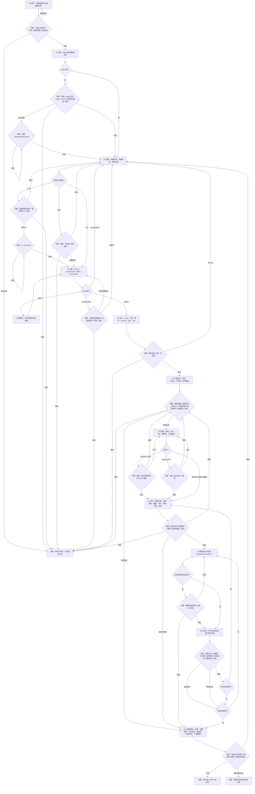

# Android TV Apps Helper

一个面向 Codex / ChatGPT Agent 的 Android TV 引导式插件。它把“连电视、选软件、核验 APK、安装、验证、恢复”收敛成可检查的状态机，让用户每轮只回答一个明确问题。

当前版本：`v0.1.0`

## 交互原则

- 每个交互回合只出现一个必答问题，并给出互斥选项。
- 宿主支持表单/选择卡时使用原生 UI；不支持或渲染失败时，原题原选项降级为编号文字菜单。
- 空白、含糊、同时选择多个单选项、回答旧问题或格式错误都不会推进状态；插件会停留在原题。
- 推荐项只标注，不预选。
- 所有 ADB 设备命令绑定已确认的 `serial`。
- 安装前展示不可变计划；设备、文件摘要、命令或风险发生变化时，原批准失效。
- “APK 有效”“已安装”“已启动”“有运行信号”“用户现场验收”分别记录，不混写为“正常”。

## 完整状态流转



所有未明确、无效或过期的回答，都回到当前 `Q*`，不执行后续命令。完整协议见 [Interaction Contract](plugins/android-tv-apps-helper/skills/android-tv-apps-helper/references/interaction-contract.md) 和 [Workflow States](plugins/android-tv-apps-helper/skills/android-tv-apps-helper/references/workflow.md)。

## 用户看到的交互

宿主支持必填选择组件时，Agent 提交一个问题卡；否则显示同构文字菜单：

```text
问题 S4-Q1：这是要操作的电视吗？

1. 确认这台电视（推荐）——后续命令只发送到此设备
2. 换一台——返回设备发现
0. 安全退出——停止尚未执行的工作

请明确回复：1、2 或 0。
```

如果用户回复“好的”“随便”“你决定”或同时回复 `1,2`，状态不会前进，Agent 会解释一次并重复 `S4-Q1`。

## 安装插件

### ChatGPT 桌面版 / Codex App

```sh
git clone https://github.com/HXWfromDJTU/android-tv-apps-helper.git
cd android-tv-apps-helper
```

将仓库作为受信任项目打开并重启客户端。项目的 `.agents/plugins/marketplace.json` 会提供 `Android TV Tools` marketplace，安装其中的 `Android TV Apps Helper`。仓库内 `.codex/config.toml` 已为该项目启用插件。

### 支持 plugin marketplace 命令的 Codex CLI

```sh
codex plugin marketplace add HXWfromDJTU/android-tv-apps-helper --ref main
```

不同 Codex CLI 版本的插件命令可用性不同；若 `codex plugin --help` 不存在，请使用桌面端安装路径。

安装后可输入：

```text
使用 $android-tv-apps-helper 帮我配置这台 Android TV
```

## APK 下载策略

| 应用 | 状态 | 下载位置 |
|---|---|---|
| Clash Meta for Android 2.11.33 | 官方源 | 仅 [MetaCubeX 官方 Release](https://github.com/MetaCubeX/ClashMetaForAndroid/releases/tag/v2.11.33)，不镜像 |
| SmartTube 32.10 Stable | 可镜像 | 本项目 `v0.1.0` Release；字节与上游 Release 摘要一致 |
| 当贝市场、Emotn UI、奈飞工厂TV | 等待权利证明 | 不公开 APK 或下载 URL |
| 佳视通、乘风TV、魄狼TV | 等待文件和权利证明 | 不公开 APK 或下载 URL |

机器可读目录位于 [`catalog/apps.json`](plugins/android-tv-apps-helper/catalog/apps.json)，第三方声明见 [THIRD_PARTY_NOTICES.md](THIRD_PARTY_NOTICES.md)。APK 二进制只放 GitHub Releases，不写入 Git 历史。

## Harness 命令

```sh
HELPER=plugins/android-tv-apps-helper/scripts/tv-helper

# 创建会话并锁定交互界面类型
$HELPER init-session outputs/demo/session.json --surface text_menu

# 校验目录；--eligible 只显示当前可下载项
$HELPER catalog --catalog plugins/android-tv-apps-helper/catalog/apps.json --eligible

# 枚举设备并读取目标身份
$HELPER adb-list
$HELPER adb-inspect --serial 192.168.1.20:5555 --state device

# 校验 APK，生成不可变计划，精确批准后才允许安装
$HELPER apk-inspect /absolute/app.apk --sha256 EXPECTED_SHA256
$HELPER plan-install outputs/demo/session.json --app-id app-id \
  --serial 192.168.1.20:5555 --apk /absolute/app.apk \
  --sha256 EXPECTED_SHA256 --out outputs/demo/plan.json
$HELPER approve-install outputs/demo/session.json \
  --plan outputs/demo/plan.json --confirmation confirm_install
$HELPER install-approved outputs/demo/session.json \
  --plan outputs/demo/plan.json --state device
```

`approve-install` 不接受泛化的 `yes` 或“继续”。安装前会再次计算 SHA-256，并核对批准的计划 ID、目标 serial 和设备状态。

## 开发与验证

仅依赖 Python 3.10+ 标准库：

```sh
python3 -m unittest discover -s tests -v
python3 -m compileall -q plugins/android-tv-apps-helper/scripts
```

项目许可证为 [MIT](LICENSE)。第三方 APK 适用其各自许可证。
